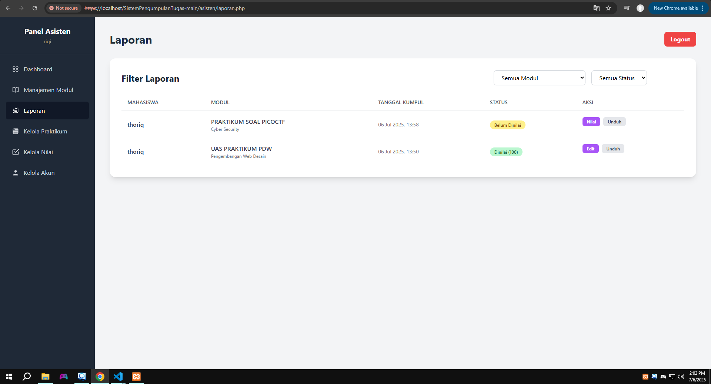
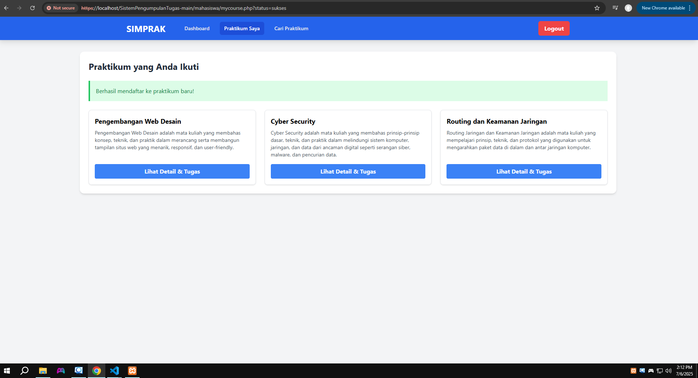
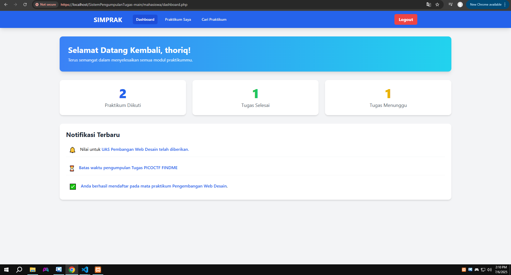
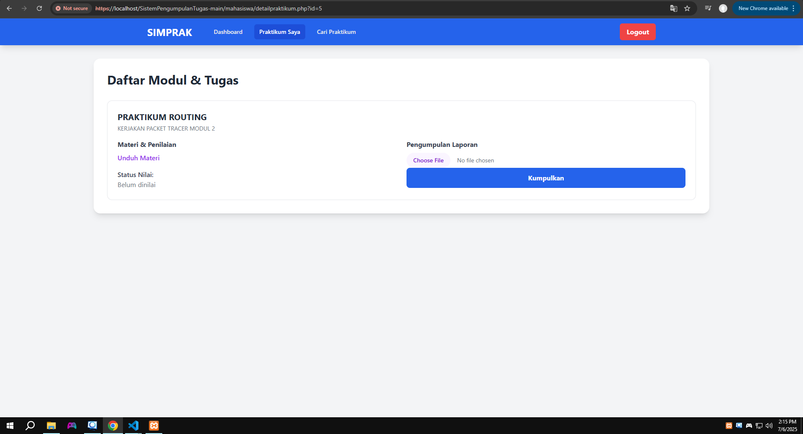
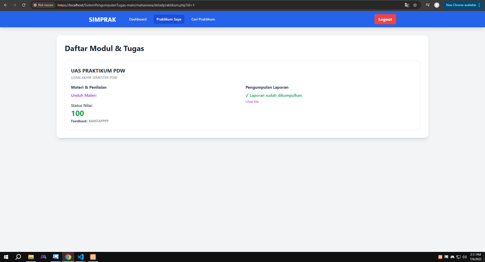

# Tampilan Antarmuka Web SIMPRAK

## 👨‍🏫 Bagian Asisten

Berikut screenshot tampilan (UI) antarmuka web SIMPRAK bagian **asisten**:

  
  
  
  

---

## 🎓 Bagian Mahasiswa

Berikut screenshot tampilan (UI) antarmuka web SIMPRAK bagian **mahasiswa**:

  
  
  
  

